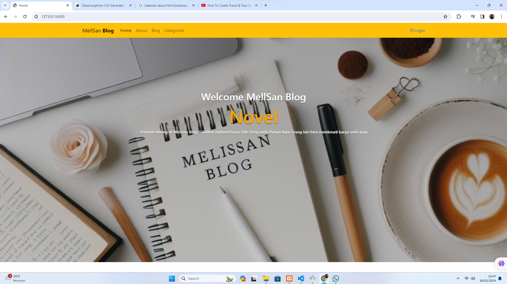
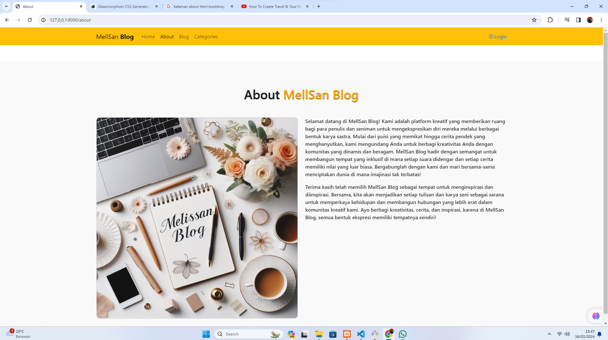
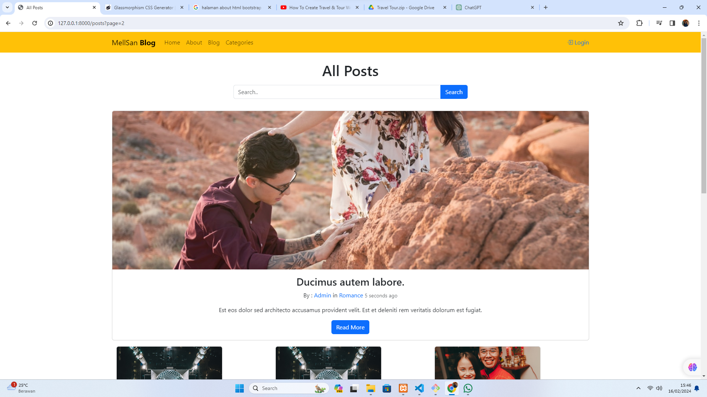
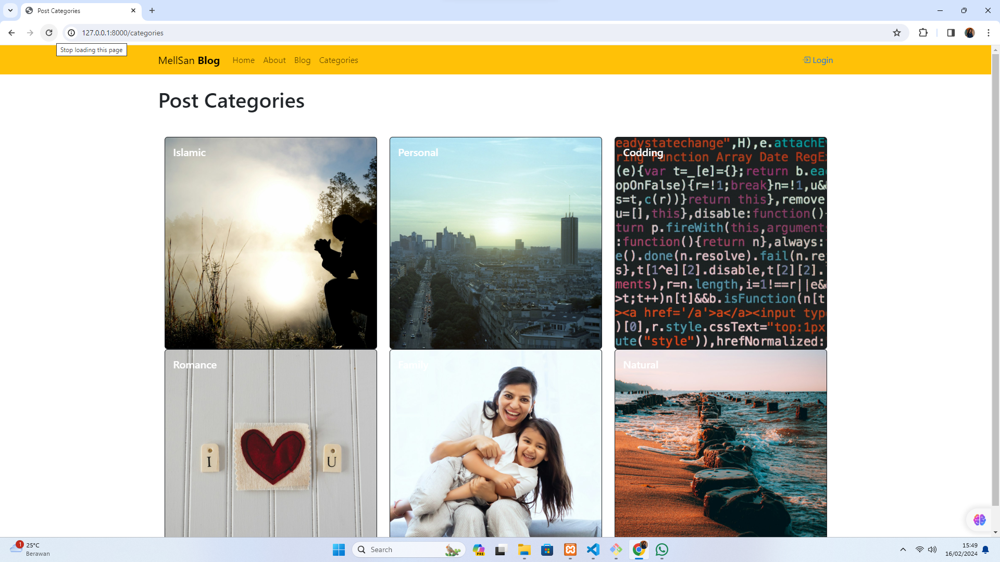

  

<h1 align="center">Hi 👋, I'm Sandy Meliyawan</h1>
<h3 align="center">Mahasiswa Universitas Mandiri</h3>

# Web UAS Semester 5 | Pemrograman WEB 1

Nama saya Sandy Meliyawan, Project ini merupakan project UAS saya pada semester sekarang.

# Teknologi yang Digunakan!
1. Framework Laravel : Versi 8.0
2. PHP
3. HTML, CSS, JS, Bootstrap
4. Database MySQL
5. Library Carbon (Mengatur Waktu : Kapan Tulisan Di Post)
6. Library Faker (Membuat Data Palsu : Membuat Postingan secara acak)
7. Unsplash : Penyedia Layanan Gambar
8. Trix : Text Editor Untuk Membuat Post

|   |  |  |
| ---------------------------------------------- | -------------------------------------------- | ------------------------------------------- |

|  |  |  |
| ---------------------------------------------- | -------------------------------------------- | ------------------------------------------- |

Selamat datang di MellSan Blog! Kami adalah platform kreatif yang memberikan ruang bagi para penulis dan seniman untuk mengekspresikan diri mereka melalui berbagai bentuk karya sastra. Mulai dari puisi yang memikat hingga cerita pendek yang menghanyutkan, kami mengundang Anda untuk berbagi kreativitas Anda dengan komunitas yang dinamis dan beragam. MellSan Blog hadir dengan semangat untuk membangun tempat yang inklusif di mana setiap suara didengar dan setiap cerita memiliki nilai yang luar biasa. Bergabunglah dengan kami dan mari bersama-sama menciptakan dunia di mana imajinasi tak terbatas!

Terima kasih telah memilih MellSan Blog sebagai tempat untuk menginspirasi dan diinspirasi. Bersama, kita akan menjadikan setiap tulisan dan karya seni sebagai sarana untuk memperkaya kehidupan dan membangun hubungan yang lebih erat dalam komunitas kreatif kami. Ayo berbagi kreativitas, cerita, dan inspirasi, karena di MellSan Blog, semua bentuk ekspresi memiliki tempatnya sendiri!

